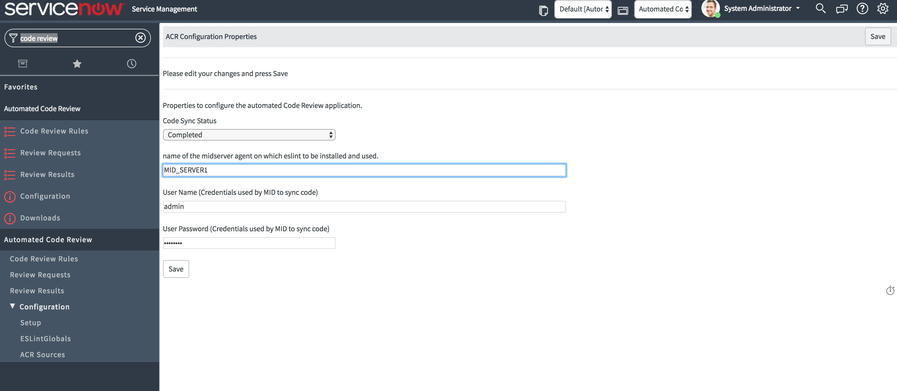

# InSee

An application for code linting and reviewing with fully customizable rules for every ServiceNow developer/reviewer.

## Install Notes:

* Download the update sets from https://github.com/SNDevTools/InSee/tree/master/Dist and install on your instance.
* Pre-requisites: 
     1. Need to have a MID Server configured to your instance. 
     2. PHP (https://www.mamp.info) and ESLint (http://eslint.org) commands and installed globally and running on the machine where the MID Server is configured.
* Setup the application on MID Server by following the below steps:
     1. System Administrator needs to change the scope to "Automated Code Review". 
     2. Go to Navigator -> Automated Code Review -> Setup
     3. Provide the name of the MID Server used for code reviewing along with the integration user credentials. 
     Note: Integration user needs to have admin role.
     4. Change the "Code Sync Status" from "Not Initialized" to "Intialized" and
     5. Click on Save. Wait for couple of minutes and refresh the page to see if the status changed to "Completed".
     
     
 
 
## About:

*InSee* is designed for developers to comply with the best practices recommended by the ServiceNow platform along with the customizable rule development capability for adding new rules specific to your team or company coding standands and practices.

*Every developer* can do the code reviewing on a single entity (Script Include, Business Rule, UI Script, Client Script etc) or on the updateSet to fix the non-compliant practices then and there. 

*Every reviewer* can do the code reviewing on multiple updateSets and the developer will have the visibility of the review validation results simultaneously to act upon in brining the highest quality of code quickly.

## Developer Persona:

## Reviewer Persona:

## Rules Administrator Persona:

## License:

MIT
