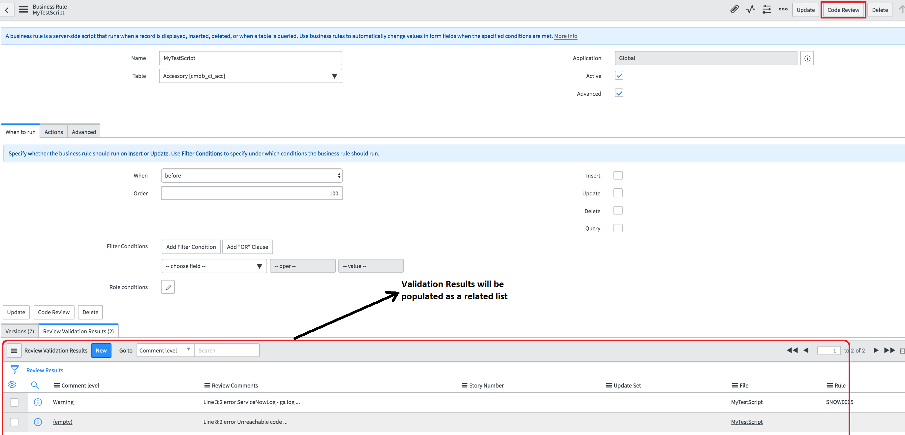
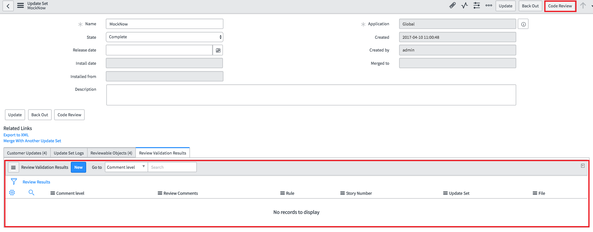
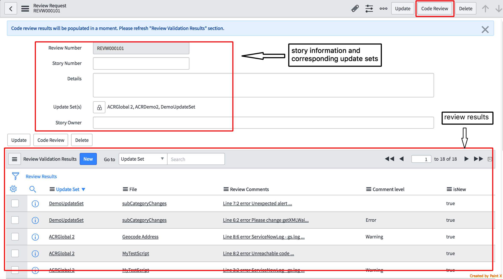
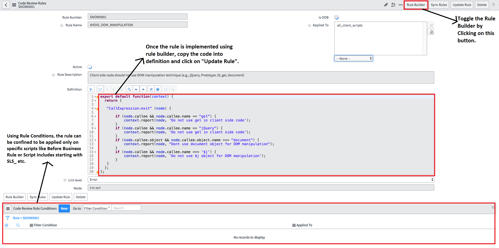
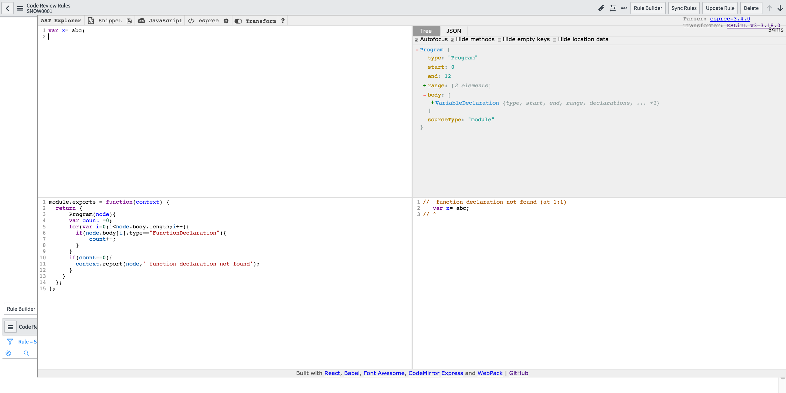

# UncleBob

An application for code linting and reviewing with fully customizable rules for every ServiceNow developer/reviewer.

## Install Notes:

* Download the update sets from https://github.com/SNDevTools/InSee/tree/master/Dist and install on your instance.
* Pre-requisites: 
     1. Need to have a MID Server configured to your instance. 
     2. PHP (https://www.mamp.info) 
     3. Installing ESLint (http://eslint.org) commands and installed globally and running on the machine where the MID Server is configured.
          1. *Windows*
               1. run the command  *>npm install eslint --save-dev* from agent folder.
               2. add *"<Agent folder>/node_modules/.bin"* to the environment variable *"PATH"*
          2. *Linux*
               1. run the command *>npm install -g eslint*
* Setup the application on MID Server by following the below steps:
     1. System Administrator needs to change the scope to "Automated Code Review". 
     2. Go to Navigator -> Automated Code Review -> Setup
     3. Provide the name of the MID Server used for code reviewing along with the integration user credentials. 
     Note: Integration user needs to have admin role.
     4. Change the "Code Sync Status" from "Not Initialized" to "Intialized" and
     5. Click on Save. Wait for couple of minutes and refresh the page to see if the status changed to "Completed".
     
     
 
 
## About:

*InSee* is designed for developers to comply with the best practices recommended by the ServiceNow platform along with the customizable rule development capability for adding new rules specific to your team or company coding standands and practices.

*Every developer* can do the code reviewing on a single entity (Script Include, Business Rule, UI Script, Client Script etc) or on the updateSet to fix the non-compliant practices then and there. 

*Every reviewer* can do the code reviewing on multiple updateSets and the developer will have the visibility of the review validation results simultaneously to act upon in brining the highest quality of code quickly.

## Developer Persona:

1. Developers can click on *"Code Review"* button on the script entities (Business Rules, Script Includes, Client Scripts and UI Scripts) and find the validation results directly on the script entity to act on accordingly.

 
 
2. Developers can also click on *"Code Review"* button on the appropriate updateSet to validate the rules against all the script entities in that updateSet so as to find and fix the validation errors related to that updateSet.

 
 
## Reviewer Persona:

Reviewer can review the code spanning across multipe updateSets using the Review Request module by creating a review request with the appropriate details like Story number, Story Owner and the list of update sets to be considered as an unit of work to be reviewed. Once the request is created, Reviewer can request for *"Code Review"* using the button on the request form and the validation results will be populated under *"Review Results"* which can then be worked on by the respective developer. Reviewer can click on the *"Code Review"* button on the Review Request form any number of times to re-validate the status of the code changes.

 
 
## Rules Administrator Persona:

Rule Administrator can maintain the Review Rules with the below capabilities:

     1. Modify the OOTB rules (OOTB rules have their rule name start with SNOW) by either deactivating/activating the rules or changing the level of the error logging (ERROR, WARNING, INFO).
     
     2. Create and modify the definitions of the custom rules
     
     3. Delete custom rules
     

     
     
### Rules Development

     ESLint rules work on the AST (Abstract Syntax Tree) which provides the tree representation of the entire code to be evaluated and the API is provided to write the rules by tranversing the Syntax tree to implement the rule specification.
Developers can use the links provided in the *Resources* Section to start learning on how to write the custom rules.
This application provides the Rule Builder interface which can be used to implement new rules on the go along with testing the rule with the sample code snippet on the same interface. 

     
## Resources

To develop new eslint rules using the AST (Abstract Syntax Tree):
### http://eslint.org/docs/developer-guide/working-with-rules
### https://astexplorer.net

## License:

MIT
